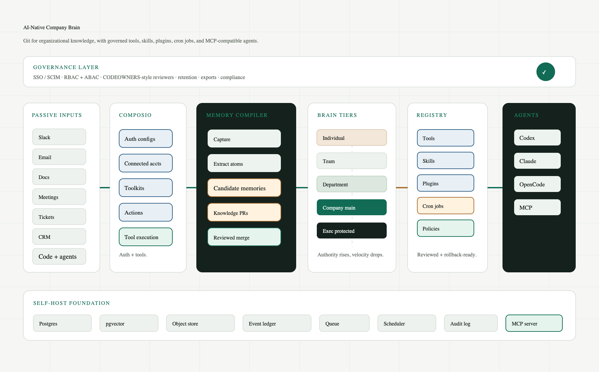
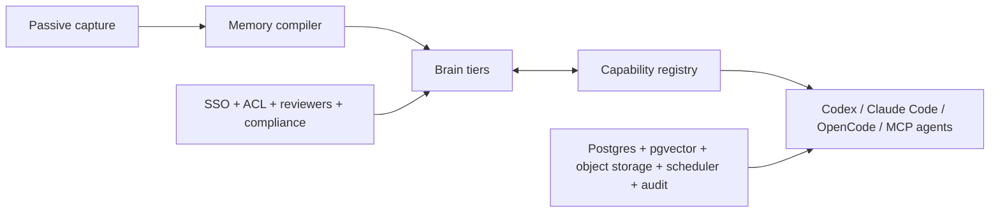

# AI-Native Company Brain Implementation Design

## What This Implements

This repository is the first self-hostable implementation of the architecture: a governed organizational brain with a mirrored tools, skills, plugins, cron, agents, and policy registry. The operating model is Git-like: noisy individual and team knowledge becomes candidate memory, candidate memory becomes a changeset, and only reviewed changesets can move into higher-authority tiers.

The app is intentionally agent-native. The web UI is the control plane for setup, audit, review, and maintenance; Codex, Claude Code, OpenCode, and generic MCP-compatible agents use the MCP/API layer for day-to-day work.

## Runtime Shape

- `app/` contains the Next.js operator console and HTTP APIs.
- `lib/` contains the typed domain model, seed repository, policy checks, quality scoring, MCP handler, and agent adapter generation.
- `db/schema.sql` contains the Postgres schema with `pgvector`, full-text search, event ledger, registry, changesets, cron runs, and quality scores.
- `docker-compose.yml` starts the app, Postgres, Redis, and MinIO for self-hosted development.
- `compatibility/` and registry examples show the intended exported shapes for Codex, Claude Code, OpenCode, and generic agents.
- Composio is the default integration layer for external app auth, sessions, connected accounts, toolkit/action discovery, MCP-facing tool access, and tool execution. The Company Brain still owns source normalization, ACL inheritance, memory review, registry policy, and audit.

## Key Interfaces

- `POST /api/v1/brain/query`: ACL-filtered retrieval with citations and registry context.
- `POST /api/v1/brain/commit`: create a candidate memory atom and review changeset.
- `GET /api/v1/atoms/:id/lineage`: trace memory to dependencies and audit events.
- `GET /api/v1/registry/search`: discover allowed tools, skills, plugins, cron jobs, agents, and policies.
- `POST /api/v1/registry/changesets`: open a registry update PR.
- `POST /api/v1/registry/:id/publish`: attempt publication after checks.
- `POST /api/v1/registry/:id/rollback`: stage rollback to the previous package version.
- `GET /api/v1/cronjobs`: list durable scheduled workflows.
- `POST /api/v1/cronjobs/:id/run`: run a cron workflow through policy gates.
- `POST /api/mcp`: JSON-RPC style MCP-compatible endpoint for `initialize`, `tools/list`, `tools/call`, `resources/list`, `resources/read`, and `prompts/list`.

## Editable Architecture

The editable Mermaid source lives at [`docs/assets/architecture.mmd`](./assets/architecture.mmd).

## Next Build Steps

For the phase-by-phase product plan, see [`docs/phase-wise-prd.md`](./phase-wise-prd.md).

1. Replace the in-memory demo repository with a Postgres repository implementation using `db/schema.sql`.
2. Add migrations, seed scripts, Composio-backed session and connected-account setup, toolkit/action discovery, and source-normalization workers for Slack, Google/Microsoft, Linear/Jira, GitHub, CRM, and meeting transcripts.
3. Add a real scheduler worker that leases due cron jobs with `SELECT ... FOR UPDATE SKIP LOCKED`.
4. Add registry package upload, sandbox execution, eval runs, and security scans before publication.
5. Add SSO/SAML/SCIM and tenant-specific encryption key management.
6. Add cloud tenancy, managed backups, usage metering, and upgrade orchestration.
